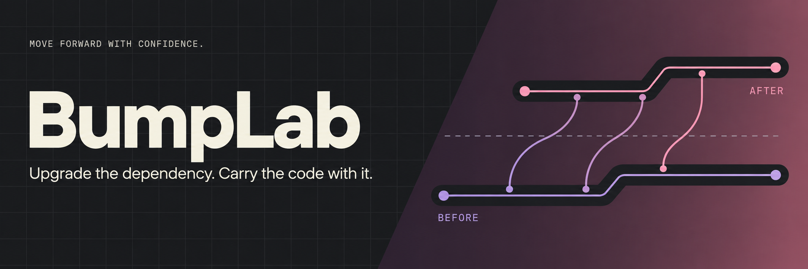

<p align="right"><a href="README.fr.md">Français</a></p>


[](https://github.com/elie-laloum/bumplab/actions/workflows/ci.yml) [](LICENSE)

**Move one direct npm dependency to an exact version, adapt the affected source, and review the migration as a tested patch.**

Node.js 24+ · npm · Git · [Quick start](#quick-start) · [How it works](#how-it-works) · [Boundaries](#boundaries)

## See it in action

<a href="assets/demo.mp4"></a>

<sub>Replay of a real demo run, with explanatory annotations and timing edited for readability. Deterministic adapter; Git and the checks execute for real.</sub>

[Watch the MP4](assets/demo.mp4) · [Reproduce this demo](docs/demo.md)

## Why it exists

### Start from green

The baseline must pass before the requested package is installed. You supply an exact version and reviewed migration notes.

### Keep the upgrade intact

The installed version, package manifest and lockfile are checked. The adapter cannot undo the upgrade to make tests pass.

### Review one migration

The result combines the dependency change, focused source edits and command evidence in a retained worktree.

## Quick start

```sh
git clone https://github.com/elie-laloum/bumplab.git
cd bumplab
npm ci
npm run check
npm run build
npm run demo
```

Clone and run from source; these commands do not assume a package has been published to a registry.

## How it works

`Green baseline → exact upgrade → adapt → verify → review`

The demo starts a local fixture registry, performs a real npm install from version 1 to 2, observes the removed API fail, and adapts the source from name() to displayName(). It requires npm and tar; no model key or public registry is needed.

## Use it on your project

Create `workflow.json`, adapt the commands to your project, and use an absolute adapter path:

```json
{
  "scope": ["src/"],
  "setup": [["npm", "ci", "--ignore-scripts"]],
  "check": ["npm", "test"],
  "update": ["npm", "install", "--save-exact", "--ignore-scripts", "{package}@{version}"],
  "verify": [],
  "attempts": 3,
  "timeoutMs": 120000,
  "agent": ["node", "/absolute/path/to/bumplab/dist/adapters/anthropic.js"]
}
```

```sh
export ANTHROPIC_API_KEY="your-key"
export ANTHROPIC_MODEL="your-enabled-model-id"
node dist/bin/bumplab.js run --repo /path/to/app --config workflow.json --out /path/to/new-result --package example-package --version 2.0.0 --notes migration.md
```

Run from this tool’s checkout. The target must be a clean Git repository; the output must be a new directory outside it. Omit checks your project does not provide. Set up dependencies explicitly. The adapter receives scoped source and failure logs; review that scope before using a hosted model.

### Bring your own agent

An adapter is an executable argv array. It reads one JSON request from stdin and returns one JSON object on stdout:

```json
{
  "summary": "Explain the change",
  "edits": [{ "path": "src/file.js", "content": "Complete replacement file contents" }]
}
```

Requests include `protocolVersion`, `workflow`, `attempt`, scoped `files`, the last `failure`, migration context when present, and `previousAttempts`. No markdown fences. Diagnostics go to stderr. See [the adapter](adapters/anthropic.ts) and [the reproducible demo](examples/demo.ts).

### Review the result

- `report.json`: command arguments, exit codes, outputs, attempts and patch SHA-256.
- `report.md`: concise run summary.
- `change.patch`: exported only after all configured checks pass on the same tracked diff.
- `worktree/`: retained for inspection; apply the patch to the recorded base after review.

Commands and adapters execute with your local permissions; a Git worktree is isolation for changes, not a security sandbox. Log files may contain application data. There is no automatic push or merge.

## Boundaries

v0.1 supports one direct dependency in an npm project with a v2/v3 package-lock. Workspaces and other package managers are not supported. Migration notes are supplied by the developer. The deterministic demo validates the workflow; the included Anthropic adapter has contract tests, not a live-model benchmark.

## Development

See the [architecture and module boundaries](docs/architecture.md). Node.js 24 LTS is the development baseline; CI also exercises Node.js 26.

Run `npm test` and `npm run demo`. Tests create real Git repositories and validate the exported changes as well as refusal paths.

[Contributing](CONTRIBUTING.md) · [Roadmap](ROADMAP.md) · [MIT license](LICENSE)

[GitLab origin](https://gitlab.elielaloum.com/elielaloum/bumplab) · [GitHub mirror](https://github.com/elie-laloum/bumplab)

The private GitLab repository is the source of record. This public mirror receives synchronized changes; GitLab access is required to view the origin.
